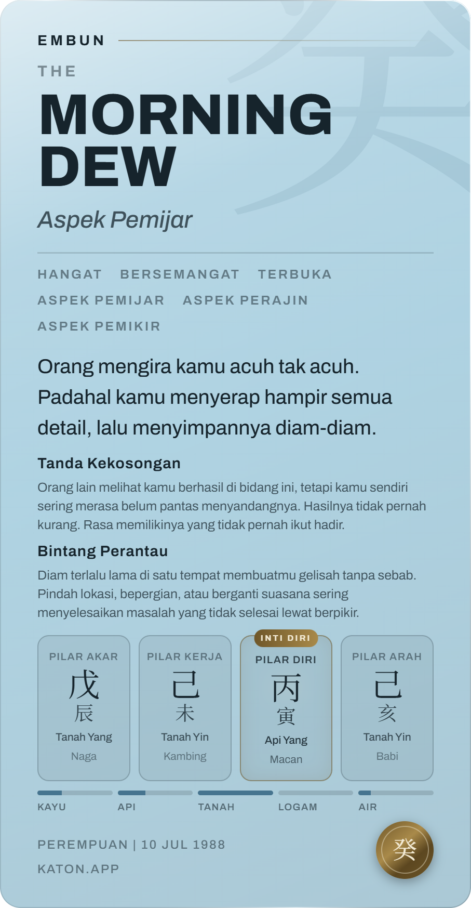

<!--
STATUS: MEASUREMENT + VERIFICATION. Claude Code, 2026-08-26.
The evidence for the Card B vertical reclaim. Ruled by Reyner the same day:
tighten vertical spacing, do not trim prose, do not change the outer dimensions.

Its condition is the reason this file exists rather than a one-line commit note:
"85px was measured on one chart and the overflow is driven by prose length, so
after the reclaim verify across the fixture's longest-prose charts, not only the
one that surfaced it."

Not a gate change. STAGE6_VERSION does not move.
-->

# Card B's vertical overflow - measured across the fixture, and past it

## THE HEADLINE NUMBERS

| | before | after |
|---|---|---|
| fixture charts overflowing | **9 of 13** | **0 of 13** |
| worst overflow | **+121px** | 0 |
| maximum-prose card per stem | not measured | **0 of 10 overflow** |
| tightest slack | n/a | **7px**, 癸 at maximum prose |

## 1. THE REPORTED DEFECT WAS NOT THE WORST CASE

The 85px in `2026-08-26-card-capture-verification.md` came from chart 1
(1989-09-13). Ranked by total prose, **chart 1 is seventh of thirteen.**

```
$ npm run audit:card-budget -- --overflow    # then read it over npm run serve:reports
```

Baseline, before any spacing changed:

| chart | stem | prose chars | overflow |
|---|---|---|---|
| 5 | 丙 | 510 | **+121** |
| 3 | 丙 | 467 | +85 |
| 1 | 丙 | 441 | +85 |
| 2 | 戊 | 499 | +67 |
| 4 | 癸 | 449 | +47 |
| 12 | 癸 | 391 | +47 |
| 9 | 甲 | 399 | +26 |
| 6 | 壬 | 511 | +8 |
| 11 | 庚 | 477 | +8 |
| 13, 8, 10, 7 | | 358 to 242 | 0 |

**Reclaiming 85px would have fixed the chart that was reported and left six
charts clipped.** That is the whole reason for Reyner's condition.

Three things vary per chart, and the card's height is the sum of all three:

```
hook            91 to 118 chars    GLOSSARY.salah_dikira, per stem
badge meaning   114 to 344 chars   up to CARD_B_BADGE_LIMIT of them
tag rows        4 or 6 tags        3 fixed + up to 3 dynamic, deduped
```

Note that prose length alone does not rank the overflow - chart 6 has the MOST
prose (511) and overflowed by only 8, while chart 5 (510) overflowed by 121.
Where the lines happen to break matters more than how many characters there are,
which is why this is measured in a browser and not counted in node.

## 2. WHY THE EXISTING AUDIT DID NOT CATCH IT

`npm run audit:card-budget` is listed in `scripts/test-all.mjs` among EXTRA_GATES
and its own header says the cap is "enforced as a TEST over `glossary.json`". It
was passing throughout. Two independent reasons, both fixed here:

- **IT COULD NOT FAIL.** The file ended with an unconditional
  `process.exitCode = 0`. It printed OVER rows and exited clean. It reported; it
  never enforced.
- **IT VARIED ONE DIMENSION.** `--probe` renders synthetic `label_meaning`
  lengths on ONE chart and holds the hook and the tag rows at whatever that chart
  has. Three things vary. This is the same shape as the hole in
  `probe-card-export.mjs` closed earlier the same day: an instrument that sits
  where nothing can go wrong.

Its slack metric was also wrong in a way worth naming, because it looked
informative. It measured to the object's last child - and on a column flex whose
last child is pinned to the bottom by `marginTop: auto`, content ALWAYS reaches
the bottom edge. **It reported 0 headroom for all thirteen charts, including the
four with hundreds of pixels to spare.** Slack is now the free space that auto
margin absorbs.

## 3. THE FIX: `RECLAIMED_B`, AND WHAT EACH LINE COST

Every value is a margin, a padding or a gap. **No type size moved, no line-height
moved, no string was shortened, and the object is still 907x1747.**

| item | was | now |
|---|---|---|
| object vertical padding (`CARD_B.padY`) | 72 | **56** |
| Indonesian name over the brass hairline | 18 | 12 |
| under the THE kicker | 14 | 10 |
| over "Aspek ..." | 25 | 16 |
| the hairline under the headline | 36 | 24 |
| over the tag rows | 28 | 20 |
| between wrapped tag rows | 14 | 10 |
| over the quote | 40 | 28 |
| over the badge block | 24 | 16 |
| between badges | 14 | 10 |
| badge label to its meaning | 6 | 4 |
| the appendix's top padding | 30 | 18 |
| pillar stem / branch / meta / animal | 12 / 6 / 14 / 4 | 8 / 4 / 10 / 3 |
| over the element bars, and their labels | 26 / 11 | 18 / 8 |
| over the foil footer | 18 | 12 |

`padY` is the largest single item and the only one that needed a test change. It
is **vertical only**: horizontal padding stays 72 on both cards, because it sets
the text measure and a narrower measure re-breaks every line - which would change
the very thing being measured.

## 4. CARD A IS UNTOUCHED, AND IT IS PROVEN

Three of these live in components shared with Card A: the kicker gap and the
Aspek gap in `<Headline>`, and the row gap in `<Tags>`. They became **props whose
defaults are Card A's existing values**, so Card B passes tighter numbers and
Card A keeps its own.

Card A's rendered markup was snapshotted across all 13 charts before and after
the change: **byte-identical, 273,662 characters on both sides.**

A permanent test pins the four shared values, and **it was shown to fail before
it was trusted** - editing `kickerGap`'s default from 14 to 10 produced
`AssertionError: Card A kicker gap moved - see RECLAIMED_B`, and reverting it
returned 62/62.

## 5. VERIFIED PAST THE FIXTURE - ONE MAXIMUM-PROSE CARD PER STEM

Thirteen charts is a sample. The card has to fit the SPACE, so the probe also
builds, for each of the ten stems, a card carrying that stem's longest hook plus
the two longest `label_meaning` strings in the glossary plus six tag rows. All of
it is real Reyner-ruled copy - nothing synthetic, nothing padded - so each is a
card the engine can actually emit.

**One per stem, because the headline is the other variable and it is not prose.**
`splitName` puts a leading article in the kicker and wraps what is left, so "The
Morning Dew" renders MORNING / DEW on two lines at 80% size where "The Sun"
renders one. Pairing the worst prose with only the longest-hook stem would have
missed that entirely - and the two-line case turned out to be the tightest of all
23.

| case | prose | overflow | slack |
|---|---|---|---|
| **MAX 癸** (The Morning Dew) | 529 | 0 | **7** |
| chart 5 丙 | 510 | 0 | 23 |
| MAX 乙 / 丙 / 戊 | 538 / 542 / 528 | 0 | 23 |
| charts 1, 3 | 441 / 467 | 0 | 59 |
| MAX 甲 丁 己 庚 辛 壬 | 515 to 532 | 0 | 82 |
| everything else | | 0 | 93 to 337 |

## 6. THE 7px, STATED PLAINLY

**癸 at maximum prose clears the card by 7 export pixels.** One wrapped line of
badge meaning is about 36px and one line of the hook about 59, so 7px is roughly
a fifth of a line.

This fits the space **as the glossary stands today**. It would not survive a
materially longer `label_meaning`, a longer `salah_dikira` line, or an archetype
rename that pushes another headline to two lines.

Per Reyner's condition, nothing overflows, so no further spacing was reclaimed.
And his reasoning for that condition is the right conclusion here too: **the
durable answer is a layout that absorbs length, not a tighter fit.** The probe now
flags any chart under 60px of slack in orange so the margin is visible rather than
rediscovered.

### WHAT CAN SPEND THE 7px - SEVEN SURFACES, NOT THREE

**The list of three is the one `lib/card/cardData.js` names directly, and it is
incomplete. Three more reach the card indirectly, and one of them produced the
tightest case in the whole sweep.** A content tranche needs the full list, because
the three that are easy to find are not the three most dangerous.

| surface | where it lands on Card B | how it spends slack |
|---|---|---|
| `bintang.label_meaning` (`cardData.js:110`) | the badge meanings | the biggest block on the card; 114 to 344 chars across two badges |
| `bintang.name_id` (`cardData.js:110`) | badge labels, and dynamic tags | a longer label wraps the badge heading |
| `tag_arketipe` (`cardData.js:144`) | the three fixed tags | a longer tag wraps the tag row |
| `salah_dikira.line` (`cardData.js:149`) | the hook | one extra wrapped line is ~59px, eight times the slack |
| **`aspek.name_id`** (`lib/semantic/index.js:233`, `facts.js:367-373`) | **TWO surfaces** - the Aspek line under the headline, AND the dynamic tag row | `dynamicTags` takes `f.label`, and a convergence fact's label is its aspek entry's `name_id` via `contentFrom`. **Nothing in `lib/card/` mentions `GLOSSARY.aspek`, so a grep of the card layer misses it entirely** |
| **`arketipe.name_en`** (`lib/semantic/index.js:231`) | **the headline** | **by WORD COUNT, not length.** `splitName` sends a leading article to the kicker and wraps the rest, so "The Morning Dew" draws MORNING / DEW on two lines where "The Sun" draws one - about 100px. 癸 is the only two-word head today and it is the 7px case. Renaming "The Sun" to "The Rising Sun" would clip the paid card, and no length ceiling anywhere would notice |
| `arketipe.name_id` (`lib/semantic/index.js:230`) | Card B's kicker (EMBUN, MATAHARI) | one line, low risk, frozen for completeness |

**`spouse_palace` and `kekuatan` do NOT reach either card.** Verified by grep over
`lib/card/` and `components/cards/` - zero hits - which is what makes prompt M's
tranche safe against this budget. It is now asserted in a test rather than
remembered.

### AND SOMETHING FAILS AUTOMATICALLY WHEN IT IS SPENT

7px only protects the card if spending it breaks the build. The layout sweep
cannot run in `npm test` - it needs a real layout engine and the real font,
because line breaking is the whole question, and adding a headless browser to CI
for one check was considered and not taken.

**But the RISK is checkable in node.** The sweep measures the worst card the
current glossary can produce, so if no string that reaches Card B grows past what
was measured, the worst case cannot get worse. `tests/card-budget.spec.mjs`
freezes all seven surfaces at their measured values and runs in `npm test`. It
fails the moment a content tranche spends the slack, and its message names the
re-calibration command rather than reading as a bug.

It was shown to fail before it was trusted, on both shapes of failure:

```
bintang.桃花.label_meaning is 315 chars, over the measured 186.
arketipe.丙.name_en now splits to 2 headline word(s), over the measured 1.
```

The second is the one a length gate could never catch. It also carries a
completeness tripwire: if `cardData.js` starts reading a glossary section that is
not budgeted, that test fails until the section is added deliberately.

## 7. THE TWO TIGHTEST CARDS, DRAWN

Captured through the real capture path and read, not inferred from numbers.

**MAX 癸 - the tightest case in the set, 7px of slack:**



Complete: kicker, two-line headline, Aspek, six tags on three rows, three-line
hook, both badges with full meanings, four pillar cells, element bars, footer and
seal. Nothing clipped. Its pillars are the seed chart's, so the day stem and the
seal disagree - it is a layout stress case, not a real reading, and the pillar
block is a fixed height either way.

**Chart 5 - the worst real chart, +121px before, 23px of slack now:**


## WHAT IS NOT ANSWERED HERE

- **The 7px.** Reported, not solved.
- **Whether the tightened air is right.** It is a measurement that the prose
  FITS. Whether Card B should breathe this way is Reyner's, and `RECLAIMED_B` is
  written as a ledger with the old value beside each new one precisely so any
  line can be paid back.
- **`--overflow` is not in `npm test`.** It needs a browser and a font, like the
  export probe. The node-side `label_meaning` cap is the part that gates, and it
  now actually exits non-zero.
