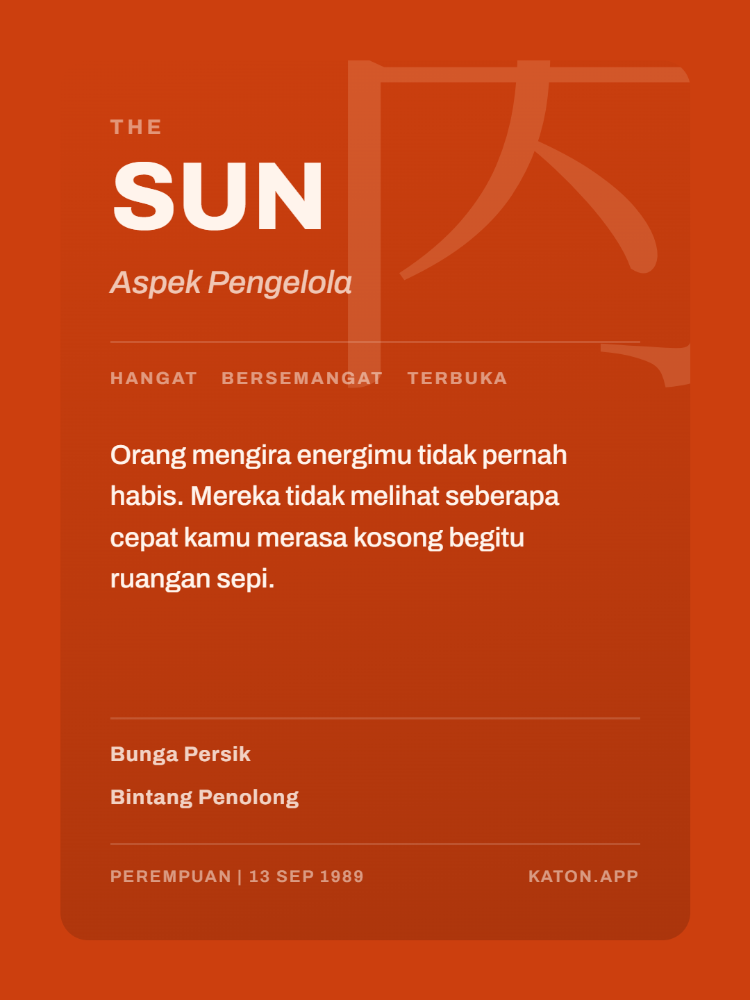
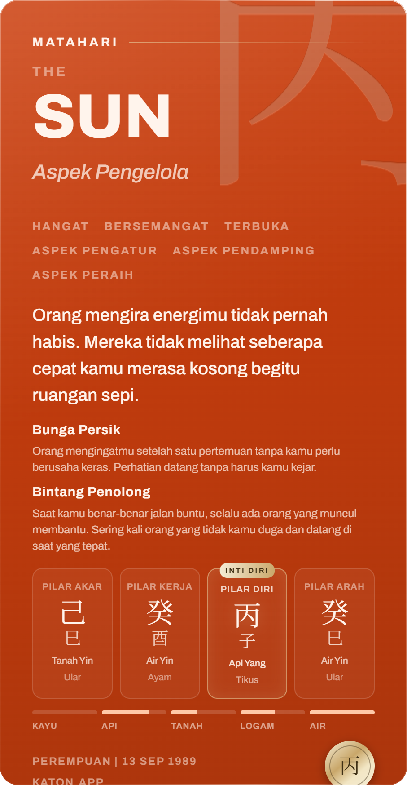

<!--
STATUS: VERIFICATION. Claude Code, 2026-08-26. The evidence for PR "the card capture".
Protocol steps 4, 5 and 6 of docs/prompts/O-amend-card.md, plus the rendered-page check.

The CAUSE is in docs/qa/2026-08-26-card-capture-cause.md. This file is the proof that the
fix works, that it can be broken again on demand, and that the page renders at both widths.

The images are committed because GitHub does not render relative image paths inside a pull
request body - only in a file view like this one. They are the actual exported files, not
screenshots of them.
-->

# The card capture - verification

## 1. THE INSTRUMENT FAILS BEFORE THE FIX AND PASSES AFTER

`scripts/probe-card-export.mjs`, driven over `npm run serve:reports`. One number per commit,
same page, same browser:

| build | probe result |
|---|---|
| `c2ec1ba` - the folded probe, on the broken capture | **16 assertions failed, 12 findings** |
| `fa366cf` - the fix | **0 failed, 0 findings** |
| the fix, with the cause put back by hand | **16 failed, 12 findings** - the same 16 |
| restored | **0 failed, 0 findings** |

The 12 findings on the broken build, verbatim from `window.__probe`:

```
probe-A-wrapped-jati: share ink is present but misplaced - box {"x":256,"y":256,"w":824,"h":1184}
probe-A-wrapped-jati: wrapped differs from bare1 by 497627 share / 413294 download px
probe-A-scaled-jati: a display-scaled node was captured instead of refused
probe-B-wrapped-jati: share ink is present but misplaced - box {"x":120,"y":179,"w":960,"h":1741}
probe-B-wrapped-jati: wrapped differs from bare1 by 1729043 share / 1504482 download px
probe-B-scaled-jati: a display-scaled node was captured instead of refused
... and the same six for 辛 Permata
```

**THE UN-FIX IS THE ONE THAT MATTERS.** Restoring the inverse-scale transform and deleting the
refusal, then capturing the production arrangement directly:

```
probe-A-scaled-jati  {"size":"1080x1440","distinct":1}
probe-B-scaled-jati  {"size":"1080x1920","distinct":1}
```

One colour across the whole image. That is the blank card, reproduced on demand, which is what
makes the diagnosis a cause rather than a correlation.

## 2. THE FILES A READER ACTUALLY GETS

Driven by clicking the real buttons on `/r/<token>`, with the download intercepted rather than
handed to the sandbox. These are the intercepted files.

### Card A, free share - `downloadCard('share', 'A')`



| | before | after |
|---|---|---|
| size | 1080x1440 | 1080x1440 |
| distinct colours | **1** | **3170** |
| ink box | none | **87,87 907x1267** |
| file | ~50 kb | 593 kb |

The ink box is the assertion that matters: 87,87 at exactly 907x1267 is the object sitting at
the ruled 86.4px feed-safe margin. Ink alone would also pass on a card drawn in the wrong place.

### Card B, paid download - `downloadCard('download', 'B')`



907x1747, 9821 distinct colours, ink filling the frame, **all four corner alphas 0** - the
transparent rounded corners the spec requires, which a JPEG or any `backgroundColor` would fill.

This card was never on the broken path (`#card-b` has always been rendered at scale 1, so the
factor was 1 and the transform an identity). What it WAS carrying is the inherited `nowrap`
fixed in `cae2cbb`: the image above is after that fix, with the quote wrapping to four lines.

**IT IS NOT YET CORRECT.** With the prose wrapping, the content is 85px taller than the card -
`scrollHeight` 1832 against `clientHeight` 1747 - so the last block runs past the bottom and the
KATON.APP wordmark is clipped. Visible at the bottom of the image above. That is a content-length
and spacing decision on the card design and it is **open, owned by Reyner**.

## 3. THE RENDERED PAGE, ALL THREE CALL SITES, BOTH WIDTHS

`/r/<token>` with a paid row, so all three are mounted at once.

| call site | node | desktop 1742px | phone 375px |
|---|---|---|---|
| `Funnel.jsx` ShareCardA | `#card-a` | layout **1080x1440**, visual 367x489 | layout **1080x1440**, visual 331x441 |
| `Funnel.jsx` PaidDelivery, off-screen | `#card-b` | layout 1080x1920, clipped to 1px | same |
| `Funnel.jsx` PaidDelivery, preview | `#card-b-preview` | 264x470 | 264x470 |
| page | `documentElement` | `scrollWidth === clientWidth` | `scrollWidth === clientWidth` |

**The layout box stays 1080 at both widths, and that is the whole point of the fix.** The capture
reads `offsetWidth`, so the export cannot depend on how wide the reader's screen is. Confirmed by
exporting at 375px, where the display scale is 0.3065: still 1080x1440, ink still at 87,87
907x1267.

Card A's field, measured left and right of the object inside its display box:

| | left | right | |
|---|---|---|---|
| before the capture fix | 11 | 11 | flex shrank the card; symmetric but narrowed |
| after it, before `e66af34` | 29 | **0** | **7px of the card clipped off the right** |
| now | 27 | 27 | symmetric, nothing clipped |

## 4. WHAT THIS RUN COST, AND WHAT IT DID NOT TOUCH

- Two mirror renders on the real Gemini key (the desktop reading, and one on the in-memory store).
- **No money moved and no real row was written for the paid check.** The paid surfaces were
  reached by running dev with `SUPABASE_*` and `XENDIT_SECRET_KEY` emptied through a gitignored
  `.env.development.local`, which puts the app on the in-memory store and the dev webhook bypass
  that `.env.example` documents. `/api/pay` returned `{"dev":true}` with no invoice. The override
  file was deleted afterwards.
- One browser detail worth recording: **html-to-image resolves its image loader inside a
  `requestAnimationFrame`, and an agent browser's tab is never visible, so rAF never fires and
  every capture hangs with no error.** A one-line shim in the probe page fixes it. That is the
  only reason this whole protocol was planned as a human handoff.
