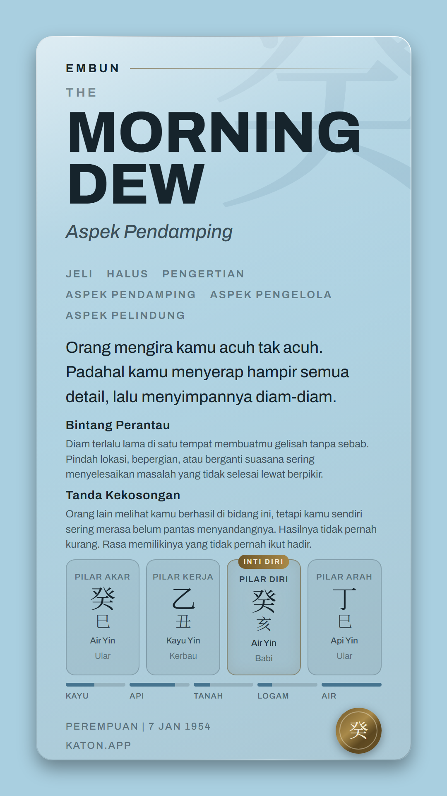
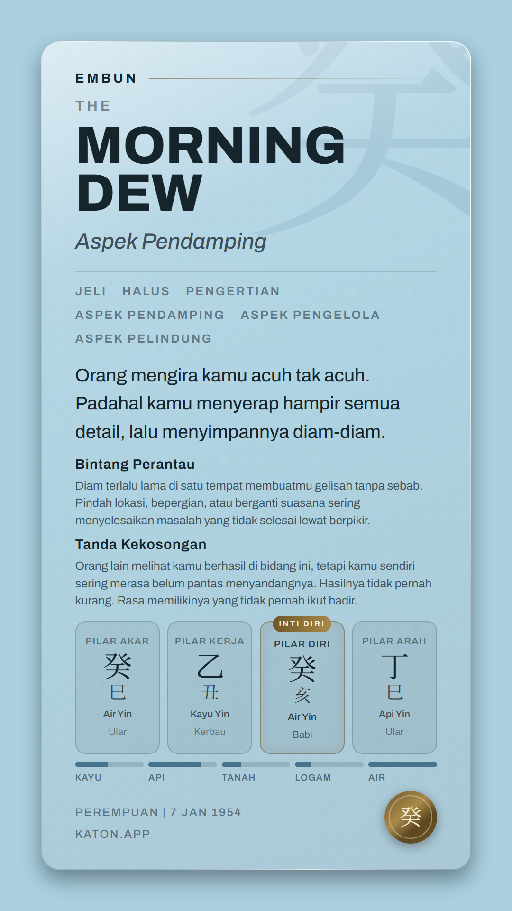

<!--
STATUS: MEASUREMENT + RESTORATION. Claude Code, 2026-09-30.
Card B overflowed on real 癸 charts. The cause was a headline size, not content.
Not a gate change. STAGE6_VERSION does not move.
-->

# Card B on 癸: the headline leaked from Card A, and real cards overflowed

## THE HEADLINE NUMBERS

| | main `329a2d4` | this branch |
|---|---|---|
| cases measured | 86 | 86 |
| overflowing | **4** (MAX 癸 and three real 癸 charts) | **0** |
| worst overflow | **+40px** | 0 |
| tightest slack | 0 | **7px** (MAX 癸 and the same three real charts) |
| Card B pixel gate | 4 of 4 IDENTICAL (none of them 癸) | 5 of 5 IDENTICAL, `gui-1954-01-07` added |

86 cases = the 13 fixture charts, the 10 MAX rows, and 63 real charts picked as the heaviest per
stem from a walk over every chart 1950-01-01 to 2005-12-31 at thirteen hours. Instrument:

```
CARD_OVERFLOW_REAL="<list>" npm run audit:card-budget -- --overflow
npm run serve:reports    # then read window.__overflow
```

**The 63 real charts are committed** (added 2026-09-30 in #188): `2026-09-30-card-b-headline/real-charts.txt`, produced by `npm run walk:card-b-heaviest`.
The thirteen times are the twelve branches with 子 twice (00:30 and 23:30). Re-run on the tree that
committed it, the walk reproduced the list byte for byte, with 癸 at 26,585 charts (the denominator
in section 2). To reproduce the sweep:

```
CARD_OVERFLOW_REAL="$(cat docs/qa/2026-09-30-card-b-headline/real-charts.txt)" npm run audit:card-budget -- --overflow
```

## 1. NOTHING IN THE CONTENT GREW

`node --test tests/card-budget.spec.mjs` was green on main: every string that reaches Card B was at or
under its 2026-08-26 length. The cause was isolated by one change and one measurement: pinning
`MORNING` back into the 0.80 reduction on main reproduced the 2026-08-26 sweep **to the pixel** (MAX
癸 7px, fixture charts 4 and 12 at 93px, where main read 43px).

**The cause is `7100f1a` (2026-08-31, prompt R commit 2).** It replaced `<Headline>`'s word-count
`x 0.80` with §0a's real-fit gate. §0a was ruled for **Card A's** 936px measure, and R's OUT OF SCOPE
says *"Card B. Entirely."* But `<Headline>` is shared, so Card B's MORNING / DEW went from 111 to 139:
+47px against 7px of slack.

## 2. MAX 癸 IS REACHABLE. A REAL CUSTOMER GETS IT

Card B shows at most `CARD_B_BADGE_LIMIT` = 2 badges. Walking every 癸 day-master chart in the range
(26,585): **208 show the two longest badges (空亡 Tanda Kekosongan 186, 驛馬 Bintang Perantau 175)
with six tags.** Most of them fit on main. **Tag ORDER decides whether six tags wrap to two rows or
three**, and three of them overflow by the same +40px as MAX 癸:

| chart | dynamic tags | main | this branch |
|---|---|---|---|
| 1954-01-07 10:00 | Pendamping, Pengelola, Pelindung | +40 | 7 slack |
| 1953-01-12 10:00 | Pendorong, Pendamping, Pengatur | +40 | 7 slack |
| 1953-05-12 02:00 | Pendamping, Pelindung, Pengatur | +40 | 7 slack |
| 1953-09-29 08:00 (the first of the 208) | Pengelola, Pendamping, Pengatur | 7 slack | 7 slack |

The MAX rows borrow chart 5's 丙 fixed tags and pillars, so they are a stress case. These three are
real, and they are now the probe's default real rows. No other stem's worst real chart overflows
(丙 tightest at 23px, the rest 73 to 82).

## 3. WHAT THE 40px LOOKED LIKE

It did not come off the edge. It came out of the layout, and each part is visible only in the export:




On main: the hairline under "Aspek Pendamping" flex-shrinks to nothing, the second badge's last line
runs straight into the pillar cells, and the seal sits about 19px off the bottom edge instead of 56.

Captured in headless Chrome with Google Fonts Archivo **and `body { line-height: 1.6 }`**, which is
`app/globals.css`. That second condition is not optional; see section 5.

## 4. THE PIXEL GATE COULD NOT SEE IT

`scripts/gate-card-b-identity.mjs` exists to prove Card B did not move under prompt R. Its four labels
named 丁 甲 癸 丙. The charts were **丙 戊 庚 丙.** "gui-embun IDENTICAL" was a statement about a
庚 card, and there was no 癸 chart, which was the one stem whose Card B changed.

- Labels are now `<pinyin>-<date>`, and the gate throws if a chart's Day Master is not its label's.
- `gui-1954-01-07` was added with its baseline written on `892f5e0^`, the tree before prompt R. The
  same run reproduced all four committed baselines pixel-for-pixel from that tree, so it is the same
  reference.
- **Shown red first**, on main's code: `FAIL gui-1954-01-07 179732 PIXELS DIFFER`, the other four
  IDENTICAL. Green on this branch: 5 of 5 IDENTICAL.

## 5. THE CARD'S FIT DEPENDS ON THE PAGE IT IS MOUNTED IN (not fixed here)

Tags, badge labels, the Aspek line and the footer lines set no `line-height`, so they **inherit it
from the host page**. The app's body is 1.6. The probe's body is `13px/1.6`, which is why it measures
the production card. A first capture from a page without that rule read **0px overflow on main**,
with tag rows at a 37px pitch instead of 50 and every text block shorter. The gate's own page has no
line-height either, which is fine for an identity check and wrong for a fit check.

So a change to `app/globals.css` body line-height changes the paid card's layout, and nothing
connects the two. Pinning line-height on the card root would fix it. It is its own change, because it
moves the gate's pixels on every chart.

## 6. WHAT IS NOT ANSWERED HERE

- **The 7px.** This is the 2026-08-26 state restored, not the durable fix. Reyner's answer to the 7px,
  *a layout that absorbs length*, is still open. Two layouts were measured on the 86 cases, main's
  code, and neither absorbs 40px within the ruled constraints (no shorter strings, no less air, no
  type scaling, 907x1747 fixed):

  | layout | worst overflow |
  |---|---|
  | main as is | +40 |
  | badge label run into its meaning's first line | +24 |
  | the two badges side by side in two columns | +16 |

  Per-block heights on 1954-01-07 10:00 (export px): headline block 455 (MORNING / DEW alone 250),
  tags 140 on three rows, hook 178, badges 328, appendix 487. The headline is the only block with
  that kind of room, and its size is a visible choice. Reyner's.
- **MOUNTAIN on Card B.** `docs/qa/2026-08-31-head-fit.md` measured MOUNTAIN at 793.48px, over Card B's
  763 measure by 30.48px. It has rendered that way since before prompt R, into the right padding,
  not off the card. Unchanged here.
